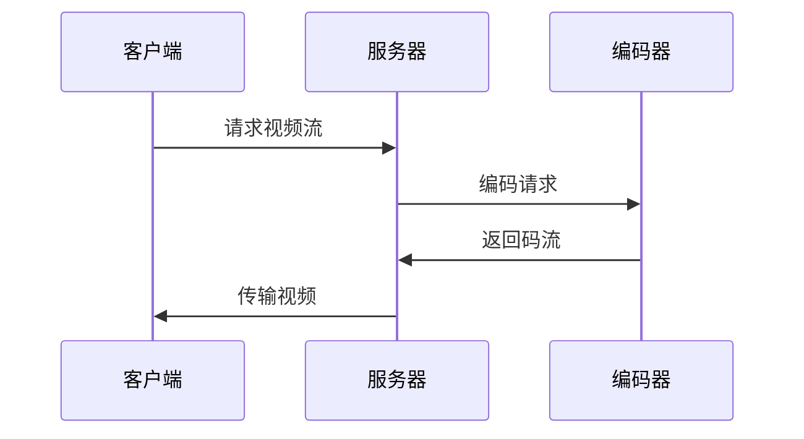

## 欢迎使用你的技术博客！

欢迎你来到我的个人技术博客！这个博客专门为刘志鹏技术写作优化，特别适合撰写包含数学公式和代码的文章。这篇教程会手把手指导你知道我的 blog 是如何从零开始使用这个博客系统。

## 第一步：环境准备

### 1.1 安装必要软件

在开始之前，你需要在电脑上安装以下软件：

#### 安装 Homebrew（Mac 包管理器）

打开「终端」应用，复制粘贴以下命令并回车：

```bash
/bin/bash -c "$(curl -fsSL https://raw.githubusercontent.com/Homebrew/install/HEAD/install.sh)"
```

> 如果已经安装过 Homebrew，可以跳过这一步。
{: .prompt-tip }

#### 安装 Ruby

Jekyll 是用 Ruby 编写的，所以需要先安装 Ruby（**必须是 3.1 到 3.x 版本**）：

> **⚠️ 重要！** 本博客主题需要 Ruby ~> 3.1（即 3.1 到 3.x），不支持 Ruby 4.0！
{: .prompt-danger }

**检查系统 Ruby 版本：**

```bash
ruby -v
```

如果显示 `ruby 2.x.x`，需要安装新版本。如果显示 `ruby 4.x.x`，也需要降级到 3.3。

**安装 Ruby 3.3（推荐）：**

```bash
# 安装 Ruby 3.3（最稳定的版本）
brew install ruby@3.3
```

**配置环境变量：**

```bash
# 如果使用 zsh（Mac 默认）
echo 'export PATH="/opt/homebrew/opt/ruby@3.3/bin:$PATH"' >> ~/.zshrc
echo 'export PATH="/opt/homebrew/lib/ruby/gems/3.3.0/bin:$PATH"' >> ~/.zshrc
source ~/.zshrc

# 如果使用 bash
echo 'export PATH="/opt/homebrew/opt/ruby@3.3/bin:$PATH"' >> ~/.bash_profile
echo 'export PATH="/opt/homebrew/lib/ruby/gems/3.3.0/bin:$PATH"' >> ~/.bash_profile
source ~/.bash_profile
```

> 💡 必须配置 PATH，否则系统会继续使用旧版本的 Ruby！
{: .prompt-warning }

**验证安装：**

```bash
ruby -v
```

应该显示类似 `ruby 3.3.10` 的信息。

> **如果还是显示旧版本？** 需要重新打开终端窗口，或者手动执行 `source ~/.zshrc`。
{: .prompt-tip }

**常见 Ruby 版本问题：**

| 问题 | 解决方案 |
|------|---------|
| `ruby 2.6.x`（Mac 系统自带） | 安装 `ruby@3.3` 并配置 PATH |
| `ruby 4.0.x`（太新） | 安装 `ruby@3.3` 并配置 PATH |
| `bundle install` 报错版本不兼容 | 确保使用 Ruby 3.1-3.x |
| PATH 配置后无效 | 重启终端或 `source ~/.zshrc` |

#### 安装 Bundler

Bundler 是 Ruby 的依赖管理工具：

```bash
gem install bundler
```

### 1.2 获取博客代码

#### 方式一：从 GitHub 克隆（推荐）

如果博客托管在 GitHub 上：

```bash
# 进入你想存放博客的目录
cd ~/Documents

# 克隆仓库（替换成你的实际仓库地址）
git clone https://github.com/icoolmedia/icoolmedia.github.io.git

# 进入博客目录
cd icoolmedia.github.io
```

#### 方式二：如果已经有代码文件夹

如果你已经通过其他方式获得了博客文件夹，直接在终端中进入该目录：

```bash
cd /path/to/your/blog/folder
```

### 1.3 安装博客依赖

这是最重要的一步！在博客目录下运行：

```bash
bundle install
```

这个命令会自动安装 Jekyll 和所有需要的 Ruby 包。安装过程可能需要几分钟，请耐心等待。

**常见错误及解决：**

#### 错误1：`command not found: jekyll`

**原因**：没有运行 `bundle install`

**解决**：
```bash
bundle install
```

#### 错误2：Ruby 版本不兼容

**错误信息**：
```
Because jekyll-theme-chirpy >= 7.1.0 depends on Ruby ~> 3.1
  and current Ruby version is = 2.6.10 (or 4.0.0),
  version solving has failed.
```

**解决**：
```bash
# 安装正确的 Ruby 版本
brew install ruby@3.3

# 配置环境变量
echo 'export PATH="/opt/homebrew/opt/ruby@3.3/bin:$PATH"' >> ~/.zshrc
echo 'export PATH="/opt/homebrew/lib/ruby/gems/3.3.0/bin:$PATH"' >> ~/.zshrc
source ~/.zshrc

# 重新安装依赖
bundle install
```

#### 错误3：权限问题

**错误信息**：`Permission denied`

**解决**：
```bash
# 不要使用 sudo！正确的做法是使用用户级别的 gem
gem install bundler
bundle install
```

**成功标志：**

安装完成后，你应该看到类似这样的提示：

```
Bundle complete! X Gemfile dependencies, XX gems now installed.
```

> 如果遇到其他错误，检查 Ruby 版本是否在 3.1-3.x 范围内。
{: .prompt-tip }

## 第二步：本地运行博客

现在可以启动博客了！

### 2.1 启动本地服务器

在博客目录下运行：

```bash
./tools/run.sh
```

或者直接使用 Jekyll 命令：

```bash
bundle exec jekyll serve --livereload
```

看到以下信息说明启动成功：

```
Server address: http://127.0.0.1:4000/
Server running... press ctrl-c to stop.
```

### 2.2 在浏览器中预览

打开浏览器，访问：

```
http://localhost:4000
```

或者：

```
http://127.0.0.1:4000
```

你应该能看到你的博客首页了！🎉

### 2.3 实时预览功能

启动服务器后，每次你修改文章或配置文件，博客会自动重新生成，刷新浏览器就能看到最新效果。这个功能叫做「live reload」，非常方便！

### 2.4 停止服务器

在终端中按 `Ctrl+C` 即可停止服务器。

## 第三步：创建你的第一篇文章

### 3.1 文章存放位置

所有博客文章都必须放在 `_posts` 目录下。

### 3.2 文件命名规则（非常重要！）

文件名格式必须严格遵守：

```
YYYY-MM-DD-title.md
```

- `YYYY`：四位数年份，如 2026
- `MM`：两位数月份，如 01
- `DD`：两位数日期，如 02
- `title`：文章的英文标题（用连字符分隔单词）
- `.md`：Markdown 文件扩展名

示例：
```
2026-01-02-my-first-post.md
2026-01-15-video-compression-intro.md
2026-02-20-understanding-fourier-transform.md
```

> 文件名中的日期会作为文章的发布日期，标题部分只是用于 URL，不会显示为文章标题。
{: .prompt-info }

### 3.3 创建新文章的步骤

#### 方法一：使用文本编辑器（推荐新手）

1. 打开「访达」，找到博客文件夹
2. 进入 `_posts` 目录
3. 右键 → 新建文本文件，命名为 `2026-01-03-my-test.md`
4. 用文本编辑器（VS Code、Sublime Text 等）打开这个文件

#### 方法二：使用终端命令

```bash
# 进入 _posts 目录
cd _posts

# 创建新文件（替换日期和标题）
touch 2026-01-03-my-test.md

# 用编辑器打开
open 2026-01-03-my-test.md
```

### 3.4 文章内容结构

每篇文章都需要在开头包含 Front Matter（元数据）。以下是一个完整的模板：

```markdown
---
title: 你的文章标题
date: 2026-01-02 10:00:00 +0800
categories: [主分类, 子分类]
tags: [标签1, 标签2, 标签3]
math: true          # 如果文章包含数学公式，设为 true
mermaid: true       # 如果需要绘制流程图，设为 true
pin: false          # 是否置顶文章
---

在这里开始写你的文章内容...
```

**Front Matter 各字段详解：**

- `title`：文章标题（会显示在网页上的真实标题）
- `date`：发布日期和时间（`+0800` 表示东八区，即北京时间）
- `categories`：分类，最多两级，用方括号和逗号
- `tags`：标签，可以有多个，帮助文章分类检索
- `math: true`：如果文章中有数学公式，必须设置为 true
- `mermaid: true`：如果要画流程图、架构图，设置为 true
- `pin: true`：设置为 true 可以把文章置顶

### 3.5 实战：写第一篇测试文章

让我们一步步创建一篇真实的文章：

**步骤1：创建文件**

```bash
cd _posts
touch 2026-01-03-hello-world.md
```

**步骤2：复制粘贴以下内容到文件中**

```markdown
---
title: 我的第一篇技术博客
date: 2026-01-03 15:00:00 +0800
categories: [测试, 入门]
tags: [hello-world, 测试]
math: true
---

## 你好，世界！

这是我的第一篇技术博客文章。今天我学会了如何使用 Jekyll 搭建博客。

## 测试数学公式

让我试试写一个简单的数学公式：

傅里叶变换是音视频处理的基础，其公式为：

$$
F(\omega) = \int_{-\infty}^{\infty} f(t)e^{-j\omega t}dt
$$

## 测试代码高亮

这是一段 Python 代码：

\```python
def hello():
    print("Hello, World!")
    
hello()
\```

## 总结

非常简单！我已经成功写出了第一篇文章。
```

**步骤3：保存文件**

**步骤4：预览效果**

确保本地服务器正在运行（`./tools/run.sh`），然后刷新浏览器，你应该能在首页看到这篇新文章了！

> 如果没有看到，检查文件名格式是否正确，Front Matter 是否有语法错误。
{: .prompt-warning }

## 第四步：写作技巧详解

### 4.1 使用数学公式（重要！）

这个博客支持 KaTeX 数学公式渲染，非常适合你的音视频算法的数学推导。

> 记住：如果文章中有数学公式，必须在 Front Matter 中设置 `math: true`！
{: .prompt-warning }

#### 行内公式

使用单个 `$` 符号包裹：

```markdown
傅里叶变换公式为 $F(\omega) = \int_{-\infty}^{\infty} f(t)e^{-j\omega t}dt$
```

效果：傅里叶变换公式为 $F(\omega) = \int_{-\infty}^{\infty} f(t)e^{-j\omega t}dt$

#### 块级公式

使用双 `$$` 符号：

```markdown
$$
H(z) = \sum_{n=0}^{N-1} h(n)z^{-n}
$$
```

效果：

$$
H(z) = \sum_{n=0}^{N-1} h(n)z^{-n}
$$

#### 复杂公式示例

```markdown
$$
\begin{aligned}
X(k) &= \sum_{n=0}^{N-1} x(n) e^{-j2\pi kn/N} \\
     &= \sum_{n=0}^{N-1} x(n) W_N^{kn}
\end{aligned}
$$
```

效果：

$$
\begin{aligned}
X(k) &= \sum_{n=0}^{N-1} x(n) e^{-j2\pi kn/N} \\
     &= \sum_{n=0}^{N-1} x(n) W_N^{kn}
\end{aligned}
$$

### 4.2 代码高亮

使用三个反引号，并指定语言：

````markdown
```python
def discrete_cosine_transform(signal):
    """计算一维DCT"""
    N = len(signal)
    dct = np.zeros(N)
    for k in range(N):
        sum_val = 0
        for n in range(N):
            sum_val += signal[n] * np.cos(np.pi * k * (2*n + 1) / (2*N))
        alpha = np.sqrt(1/N) if k == 0 else np.sqrt(2/N)
        dct[k] = alpha * sum_val
    return dct
```
````

效果：

```python
def discrete_cosine_transform(signal):
    """计算一维DCT"""
    N = len(signal)
    dct = np.zeros(N)
    for k in range(N):
        sum_val = 0
        for n in range(N):
            sum_val += signal[n] * np.cos(np.pi * k * (2*n + 1) / (2*N))
        alpha = np.sqrt(1/N) if k == 0 else np.sqrt(2/N)
        dct[k] = alpha * sum_val
    return dct
```

支持的语言包括：`python`, `java`, `cpp`, `javascript`, `bash`, `yaml`, `json` 等。

> 语言标识要小写，比如 `python` 而不是 `Python`
{: .prompt-tip }

### 4.3 提示框

使用特殊的提示框来突出重要信息：

```markdown
> 这是一个提示信息
{: .prompt-tip }

> 这是一个重要信息
{: .prompt-info }

> 这是一个警告信息
{: .prompt-warning }

> 这是一个危险信息
{: .prompt-danger }
```

效果：

> DCT在视频压缩中具有优秀的能量集中特性！
{: .prompt-tip }

> H.264是当前应用最广泛的视频编码标准。
{: .prompt-info }

> 量化步长过大会导致明显的块效应。
{: .prompt-warning }

> 不要4.4 插入图片

#### 步骤1：准备图片

将图片文件放到 `assets/img/` 目录下。例如：
- `assets/img/video-codec-diagram.png`
- `assets/img/dct-example.jpg`
- `assets/img/tencent.svg`（已有示例）

#### 步骤2：在文章中引用

```markdown

_图1: 腾讯公司标志_
```

**实际效果预览：**


_图1: 腾讯公司标志_

**图片路径说明：**
- 路径以 `/assets/img/` 开头（**注意开头的 `/` 不能省略！**）
- 后面跟图片文件名
- 下划线 `_` 包裹的文字会显示为图片说明
- 图片描述文字（方括号内）是 alt 文本，图片无法加载时显示

> 图片格式支持 .jpg, .png, .gif, .svg 等
{: .prompt-info }

#### 💡 VSCode 中预览图片的说明

> **重要提示**：在 VSCode 的 Markdown 预览中，图片可能无法显示，因为路径是相对于网站根目录的（以 `/` 开头）。但是在 Jekyll 博客中会正常显示！
{: .prompt-warning }

**为什么 VSCode 中看不到图片？**
- Jekyll 博客使用的是绝对路径（`/assets/img/xxx.jpg`）
- VSCode Markdown 预览期望的是相对路径（`../assets/img/xxx.jpg`）
- 这是正常的！不用担心！

**正确的预览方法：**
1. ✅ 在文章中使用绝对路径：`/assets/img/xxx.jpg`
2. ✅ 启动本地服务器：`./tools/run.sh`
3. ✅ 在浏览器中预览：`http://localhost:4000`

这样既能确保路径正确，又能看到真实的显示效果！

> 永远不要为了在 VSCode 中预览而修改路径，这会导致博客中图片无法显示！
{: .prompt-danger }

### 4.5
图片应放在 `assets/img/` 目录下。

### 7. 表格

```markdown
| 编码标准 | 压缩率 | 计算复杂度 | 应用场景 |
|---------|--------|-----------|---------|
| H.264   | 中等   | 中等      | 通用    |
| H.265   | 高     | 高        | 4K/8K   |
| AV1     | 很高   | 很高      | 流媒体  |
```

效果：

| 编码标准 | 压缩率 | 计算复杂度 | 应用场景 |
|---------|--------|-----------|---------|
| H.264   | 中等   | 中等      | 通用    |
| H.265   | 高     | 高        | 4K/8K   |
| AV1     | 很高   | 很高      | 流媒体  |

**表格语法说明：**
- 第一行是表头
- 第二行是分隔线（用 `---` 和 `|` 分隔）
- 后面的行是数据
- 每列用 `|` 分隔
- 不需要对齐，Markdown 会自动处理

### 4.6 文件路径高亮

当提到文件或配置时，可以用特殊格式高亮：

```markdown
编辑文件 `_config.yml`{: .filepath} 来修改博客配置。
```

效果：编辑文件 `_config.yml`{: .filepath} 来修改博客配置。

### 4.7 绘制流程图（Mermaid）

在 Front Matter 中设置 `mermaid: true`，然后可以画各种图表：

#### 流程图示例

````markdown

````

#### 时序图示例

````markdown

````

## 第五步：了解目录结构

了解博客的目录结构，有助于你更好地管理内容：

```
icoolmedia.github.io/          # 博客根目录
├── _config.yml                 # 博客配置文件（重要！）
├── _posts/                     # 所有文章都放这里
│   ├── 2026-01-02-article1.md
│   └── 2026-01-03-article2.md
├── _tabs/                      # 顶部导航页面
│   ├── about.md                # "关于"页面
│   ├── categories.md           # "分类"页面
│   ├── tags.md                 # "标签"页面
│   └── archives.md             # "归档"页面
├── assets/                     # 静态资源
│   ├── img/                    # 图片文件夹
│   │   └── lzp.jpg             # 你的头像
│   └── lib/                    # 第三方库
├── tools/                      # 工具脚本
│   ├── run.sh                  # 运行本地服务器
│   └── test.sh                 # 构建生产版本
├── Gemfile                     # Ruby 依赖配置
└── README.md                   # 项目说明
```

**重要文件说明：**

- `_config.yml`：博客的全局配置，包括标题、作者、URL 等
- `_posts/`：你的所有文章，必须严格遵守命名规则
- `_tabs/about.md`：你的个人介绍页面，已经定制好了
- `assets/img/`：存放所有图片，包括你的头像 lzp.jpg
- `Gemfile`：定义 Jekyll 和插件的版本，一般不需要改

## 第六步：分类和标签建议

作为音视频专家，建议使用以下分类体系：

### 推荐的主要分类：

1. **音视频技术**
   - 视频编码
   - 音频处理
   - 实时通信
   - 流媒体

2. **数学基础**
   - 信号处理
   - 线性代数
   - 概率论
   - 优化理论

3. **算法实现**
   - 编解码算法
   - 质量评估
   - 性能优化

4. **工程实践**
   - 项目经验
   - 问题排查
   - 性能调优

### 推荐的常用标签：

技术相关：`H264`, `H265`, `AV1`, `VP9`, `WebRTC`, `FFmpeg`, `GStreamer`

算法相关：`DCT`, `DWT`, `量化`, `率失真`, `运动估计`, `熵编码`, `帧间预测`

质量相关：`PSNR`, `SSIM`, `VMAF`, `质量评估`

应用相关：`直播`, `点播`, `视频会议`, `短视频`, `云游戏`

前沿技术：`深度学习`, `神经网络编码`, `GPU加速`, `硬件编码`

## 第七步：发布和部署

### 7.1 本地预览流程（推荐）

每次写完文章后，建议先本地预览：

1. **写文章**：在 `_posts/` 创建新文章
2. **启动服务器**：运行 `./tools/run.sh`
3. **预览效果**：访问 `http://localhost:4000`
4. **修改完善**：看到不满意的地方直接修改，保存后自动刷新
5. **确认无误**：检查标题、公式、代码等显示正常

### 7.2 部署到 GitHub Pages

当你对文章满意后，可以发布到互联网上：

#### 第一次部署（只需做一次）

**步骤1：在 GitHub 创建仓库**

1. 访问 [github.com](https://github.com)，登录你的账号
2. 点击右上角的 `+` → `New repository`
3. 仓库名必须是：`你的用户名.github.io`
   - 例如：`icoolmedia.github.io`
4. 选择 `Public`（公开）
5. 点击 `Create repository`

**步骤2：关联本地仓库**

在博客目录下运行（如果还没有初始化 Git）：

```bash
# 初始化 Git 仓库
git init

# 添加所有文件
git add .

# 提交
git commit -m "Initial commit: 博客初始化"

# 关联远程仓库（替换成你的用户名）
git remote add origin https://github.com/icoolmedia/icoolmedia.github.io.git

# 推送到 GitHub
git push -u origin main
```

> 如果推送时要求输入用户名和密码，建议使用 Personal Access Token 而不是密码。
{: .prompt-info }

**步骤3：开启 GitHub Pages**

1. 在 GitHub 仓库页面，点击 `Settings`
2. 左侧菜单找到 `Pages`
3. 在 `Source` 下选择 `GitHub Actions`
4. 等待几分钟，GitHub 会自动构建和部署

完成后，你的博客就可以通过 `https://icoolmedia.github.io` 访问了！

#### 日常更新文章

以后每次写新文章或修改内容，只需要：

```bash
# 1. 查看修改了哪些文件
git status


### Q2: `bundle install` 报错：Ruby 版本不兼容

**完整错误信息**：
```
Because jekyll-theme-chirpy >= 7.1.0 depends on Ruby ~> 3.1
  and current Ruby version is = 2.6.10,
  version solving has failed.
```

**原因**：
- Mac 系统自带的 Ruby 版本是 2.6.x，太旧
- 或者你安装了 Ruby 4.0，太新

**解决方案**：
```bash
# 1. 安装 Ruby 3.3
brew install ruby@3.3

# 2. 配置环境变量（重要！）
echo 'export PATH="/opt/homebrew/opt/ruby@3.3/bin:$PATH"' >> ~/.zshrc
echo 'export PATH="/opt/homebrew/lib/ruby/gems/3.3.0/bin:$PATH"' >> ~/.zshrc

# 3. 重新加载配置
source ~/.zshrc

# 4. 验证版本（应该显示 3.3.x）
ruby -v

# 5. 重新安装依赖
bundle install
```

> **为什么不升级到 Ruby 4.0？** 因为 Jekyll 主题还不支持 Ruby 4.0，Ruby 3.3 是目前最稳定的选择。
{: .prompt-info }
# 2. 添加所有修改
git add .

# 3. 提交（写上有意义的提交信息）
git commit -m "新增文章：视频编码原理详解"

# 4. 推送到 GitHub
git push
```

推送后，GitHub Actions 会自动构建和部署，几分钟后你的网站就会更新。

### 7.3 Git 基础命令速查
`bundle install` 报错：Ruby 版本不兼容

**完整错误信息**：
```
Because jekyll-theme-chirpy >= 7.1.0 depends on Ruby ~> 3.1
  and current Ruby version is = 2.6.10,
  version solving has failed.
```

**原因**：
- Mac 系统自带的 Ruby 版本是 2.6.x，太旧
- 或者你安装了 Ruby 4.0，太新

**解决方案**：
```bash
# 1. 安装 Ruby 3.3
brew install ruby@3.3

# 2. 配置环境变量（重要！）
echo 'export PATH="/opt/homebrew/opt/ruby@3.3/bin:$PATH"' >> ~/.zshrc
echo 'export PATH="/opt/homebrew/lib/ruby/gems/3.3.0/bin:$PATH"' >> ~/.zshrc

# 3. 重新加载配置
source ~/.zshrc

# 4. 验证版本（应该显示 3.3.x）
ruby -v

# 5. 重新安装依赖
bundle install
```

> **为什么不升级到 Ruby 4.0？** 因为 Jekyll 主题还不支持 Ruby 4.0，Ruby 3.3 是目前最稳定的选择。
{: .prompt-info }

### Q3: PATH 配置后 `ruby -v` 还是显示旧版本？

**解决方案**：
```bash
# 方法1：重新加载配置
source ~/.zshrc

# 方法2：重启终端
# 关闭终端窗口，重新打开

# 方法3：检查配置是否正确添加
cat ~/.zshrc | grep ruby
```4: 数学公式不显示？

**原因**：忘记设置 `math: true`。

**解决**：在文章的 Front Matter 中添加：
```yaml
---
title: 你的标题
math:5: 代码高亮不正确？

**原因**：语言标识写错了。

**解决**：确保语言标识正确且小写，例如：
- ✅ `python`
- ❌ `Python` 或 `py`

### Q6: 新文章不显示在首页？

**可能原因**：

1. 文件名格式错误 → 检查是否为 `YYYY-MM-DD-title.md`
2. Front Matter 语法错误 → 检查 `---` 包裹是否完整
3. 日期是未来 → 检查 `date:` 字段，未来的文章默认不显示

> Jekyll 会跳过未来日期的文章。如果你的系统时间不对，或者文章日期写成了未来，文章就不会显示。
{: .prompt-warning }

### Q7true    # 添加这一行
---
```
7: 本地预览时提示端口被占用？

**解决**：
```bash
# 查找占用 4000 端口的进程
lsof -ti:4000

# 杀死该进程（替换 PID）
kill -9 <PID>

# 或者使用不同端口
bundle exec jekyll serve --port 4001
```

### Q8
### Q5

### Q4: 
```bash
# 查看当前状态
git status

# 查看修改内容
git diff

# 添加所有修改
git add .

# 提交修改
git commit -m "提交说明"

# 推送到远程
git push

# 拉取远程更新
git pull

# 查看提交历史
git log
```

## 第八步：常见问题解答

### Q1: 运行 `./tools/run.sh` 报错 "command not found: jekyll"

**原因**：没有安装依赖。

**解决**：
```bash
bundle install
```

### Q2: 数学公式不显示？

**原因**：忘记设置 `math: true`。

**解决**：在文章的 Front Matter 中添加：
```yaml
---
title: 你的标题
math: true    # 添加这一行
---
```

### Q3: 代码高亮不正确？

**原因**：语言标识写错了。

**解决**：确保语言标识正确且小写，例如：
- ✅ `python`
- ❌ `Python` 或 `py`

### Q4: 新文章不显示在首页？

**可能原因**：

1. 文件名格式错误 → 检查是否为 `YYYY-MM-DD-title.md`
2. Front Matter 语法错误 → 检查 `---` 包裹是否完整
3. 日期10: 如何修改博客主题颜色？

**方法**：编辑 `_config.yml`{: .filepath} 中的 `theme_mode` 选项：

```yaml
theme_mode: light  # 亮色主题
# 或
theme_mode: dark   # 暗色主题
# 或不设置，跟随系统
```

### Q11未来 → 检查 `date:` 字段，未来的文章默认不显示

### Q5: 本地预览时提示端口被占用？

**解决**：
```bash
# 查找占用 4000 端口的进程
lsof -ti:4000

# 杀死该进程（替换 PID）
kill -9 <PID>

# 或者使用不同端口
bundle exec jekyll serve --port 4001
```
1: 文章太长，能不能只显示摘要？

**方法**：在文章中添加 `<!-- more -->` 标记：

```markdown
这是文章摘要部分...

<!-- more -->

这里是文章详细内容...
```

首页只会显示 `<!-- more -->` 之前的内容。

### Q12
### Q6: 推送到 GitHub 时要求密码？

**解决**：GitHub 已不再支持密码登录，需要使用 Personal Access Token：

1.# Q12: 如何让某篇文章置顶？

**方法**：在 Front Matter 中设置：

```yaml
---
title: 重要文章
pin: true    # 置顶
---
```

### Q13: 启动博客时报错 "zsh: parse error"？

**错误信息**：
```
/Users/xxx/.zshrc:86: defining function based on alias 'gp'
/Users/xxx/.zshrc:86: parse error near '()'
```

**原因**：`.zshrc` 配置文件有语法错误（通常是别名或函数定义问题）。

**解决**：这个错误不影响博客运行，可以忽略。如果想修复，编辑 `.zshrc` 文件检查第 86 行附近的配置。

## 访问 GitHub Settings → Developer settings → Personal access tokens
2. 生成新 token（勾选 `repo` 权限）
3. 将 token 当作密码使用

或者配置 SSH 密钥（推荐）。

### Q7: 图片不显示？

**检查清单**：
- 图片是否在 `assets/img/` 目录下？
- 路径是否以 `/assets/img/` 开头？
- 文件名是否正确（区分大小写）？
- 图片格式是否支持（.jpg, .png, .gif, .svg）？

### Q8: 如何修改博客主题颜色（亮色/暗色）？

**方法**：编辑 `_config.yml`{: .filepath} 中的 `theme_mode` 选项：

```yaml
theme_mode: light  # 亮色主题
# 或
theme_mode: dark   # 暗色主题
# 或不设置，跟随系统
```

### Q9: 文章太长，能不能只显示摘要？

**方法**：在文章中添加 `<!-- more -->` 标记：

```markdown
这是文章摘要部分...

<!-- more -->

这里是文章详细内容...
```

首页只会显示 `<!-- more -->` 之前的内容。

### Q10: 如何让某篇文章置顶？

**方法**：在 Front Matter 中设置：

```yaml
---
title: 重要文章
pin: true    # 置顶
---
```

## 第九步：写作最佳实践

根据音视频技术博客的特点，这里给你一些写作建议：

### 1. 标题要清晰且具体

❌ 不好的标题：
- "关于视频编码"
- "我的学习笔记"

✅ 好的标题：
- "H.264视频编码中的帧内预测算法详解"
- "WebRTC 视频传输中的拥塞控制机制"

### 2. 文章开头要有引言

每篇文章开头用 1-2 段话说明：
- 要解决什么问题？
- 读者能学到什么？
- 文章的组织结构

示例：
```markdown
## 引言

视频编码是现代多媒体技术的核心。本文将深入探讨H.264编码器中的
率失真优化（RDO）算法，包括其数学原理、实现细节和性能优化技巧。

本文组织如下：第2节介绍率失真理论基础；第3节分析H.264中的RDO实现；
第4节给出优化案例；第5节总结全文。
```

### 3. 公式要配合文字解释

❌ 只给公式：
```markdown
$$
J = D + \lambda R
$$
```

✅ 公式 + 解释：
```markdown
在率失真优化中，我们使用拉格朗日乘数法来平衡失真和码率：

$$
J = D + \lambda R
$$

其中：
- $J$ 是总代价函数
- $D$ 是失真度（通常用 MSE 或 SAD 衡量）
- $R$ 是编码所需比特数
- $\lambda$ 是拉格朗日乘数，控制率失真权衡
```

### 4. 代码要有注释和说明

```python
def calculate_psnr(original, compressed):
    """
    计算两帧图像之间的 PSNR 值
    
    Args:
        original: 原始图像（numpy数组）
        compressed: 压缩后的图像（numpy数组）
    
    Returns:
        float: PSNR 值（单位：dB）
    """
    mse = np.mean((original - compressed) ** 2)
    if mse == 0:
        return float('inf')
    max_pixel = 255.0
    psnr = 20 * np.log10(max_pixel / np.sqrt(mse))
    return psnr
```

### 5. 使用图表辅助理解

对于复杂的概念，画图说明：
- 流程图：展示算法步骤
- 架构图：展示系统结构
- 数据图：展示实验结果

### 6. 文章要有总结

文章结尾总结要点，并给出：
- 关键结论
- 实践建议
- 延伸阅读

### 7. 分段要合理

- 每个段落只讨论一个主题
- 段落长度适中（3-7行）
- 使用小标题分隔不同部分

## 示例：完整文章结构

```markdown
---
title: 视频编码中的运动估计算法优化
date: 2026-01-05 10:00:00 +0800
categories: [音视频技术, 视频编码]
tags: [运动估计, 算法优化, H264]
math: true
---

## 引言

（说明背景、目的、文章结构）

## 运动估计基础

### 块匹配原理

（基础概念解释）

### 常用搜索算法

（介绍不同算法）

## 算法优化技术

### 快速搜索算法

（详细讲解）

### SIMD 加速

（代码示例）

## 实验结果

（数据、图表）

## 总结与展望

（总结要点、未来方向）

## 参考文献

1. ...
2. ...
```

## 开始你的创作之旅！

现在你已经掌握了从环境搭建到文章发布的全流程，开始创作你的第一篇技术博客吧！

> 技术博客的价值在于分享知识、总结经验、启发思考。不要追求完美，勇于记录你的学习和实践！
{: .prompt-tip }

祝你写作愉快！🚀

## 技术支持

如有问题，可以：
1. 查看 [Jekyll 官方文档](https://jekyllrb.com/docs/)
2. 参考 [Chirpy 主题文档](https://chirpy.cotes.page/)
3. 查看 [Markdown 语法指南](https://www.markdownguide.org/)

---

> 这篇指南会持续更新，添加更多实用技巧和最佳实践。
{: .prompt-info }
